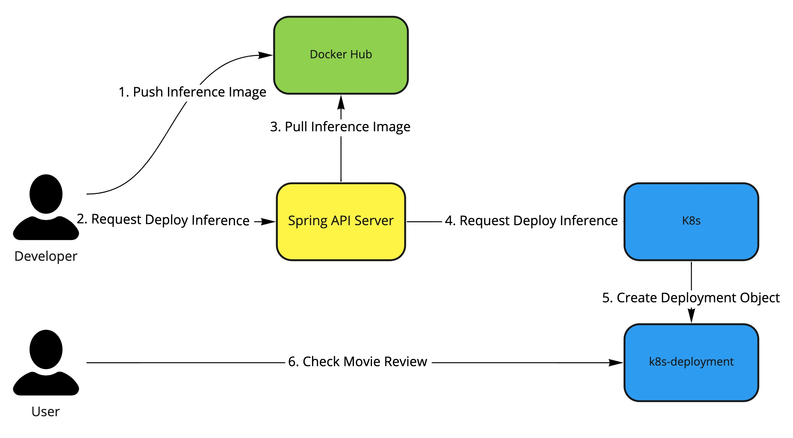
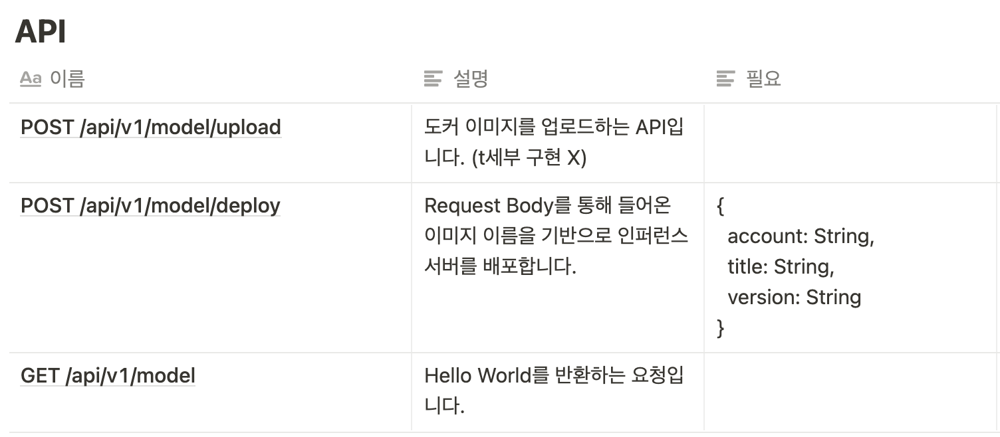
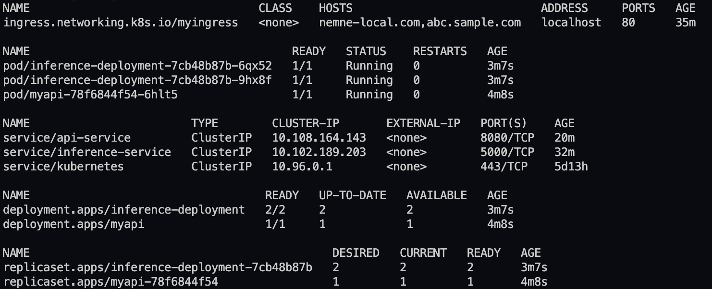
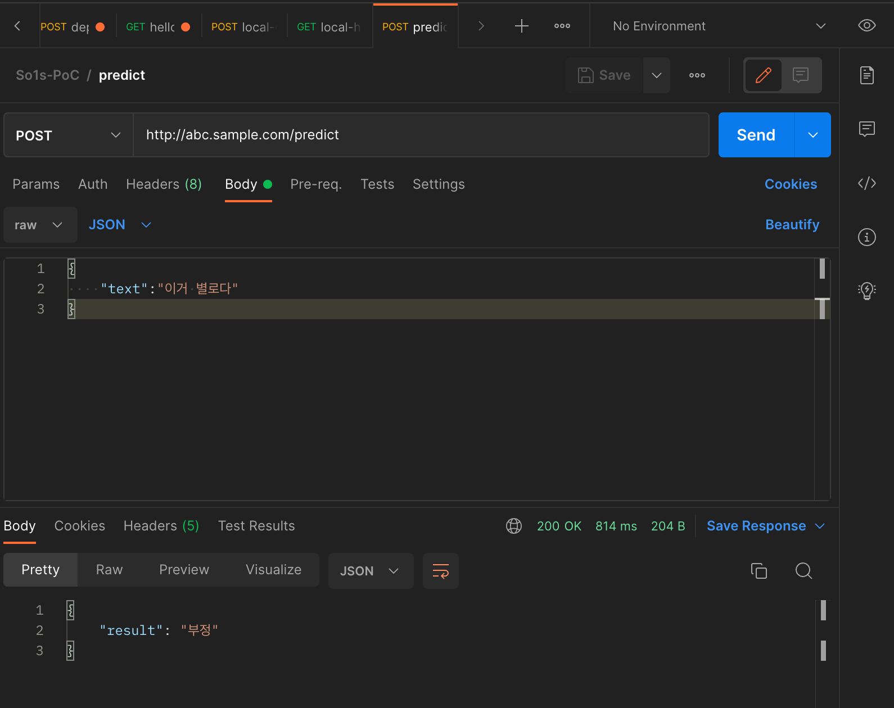

# K8s 기반 ML 모델 Real-Time Inference 서빙 Application 프로젝트 So1s 개인 PoC

## PoC 아키텍처

 
 
 

 
 
 

### 실행하기전 설정 사항

1. 로컬 클러스터 환경 내에 실행 하는 것이므로 ingress Host 설정은 별도로 해줘야합니다.
2. 추가로 ingress도 사전에 실행해줘야합니다. (test.ingress.yaml 참고)
3. 테스트 해볼 이미지가 없다면 **dlatqdlatq/tf_service:latest**로 실행해주면 됩니다.

 
 

## 실행 결과

